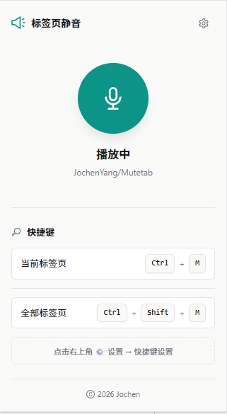
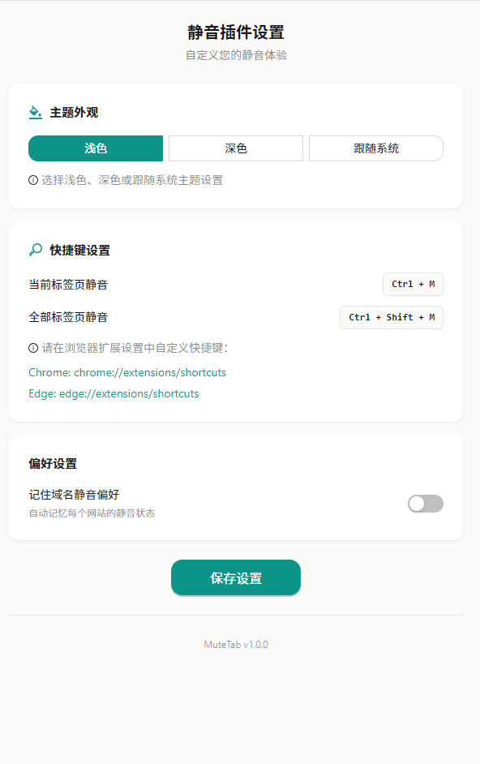

# MuteTab - 标签页静音插件

<div align="center">

[]()
[]()
[]()
[]()

一款简洁优雅的 Chrome/Edge 浏览器标签页静音扩展程序。

</div>

## 效果预览

| 弹窗页面 | 设置页面 |
|:---:|:---:|
|  |  |

## 功能特性

- 🔇 **一键静音** - 快速静音/取消静音当前标签页音频
- ⌨️ **快捷键支持** - 自定义键盘快捷键，快速操作
- 🎨 **精美 UI** - 简洁优雅的界面设计，支持浅色/深色/跟随系统主题
- 💾 **状态记忆** - 自动记住域名静音偏好
- 🚀 **轻量快速** - 基于 React 19 + Ant Design 6 构建

## 支持的浏览器

- Google Chrome 88+
- Microsoft Edge 88+

## 安装方法

### 从源码安装

```bash
# 克隆仓库
git clone https://github.com/JochenYang/Mutetab.git
cd Mutetab

# 安装依赖
npm install

# 构建项目
npm run build

# 加载扩展
# 1. 打开 Chrome/Edge 扩展管理页面 (chrome://extensions 或 edge://extensions)
# 2. 开启「开发者模式」
# 3. 点击「加载已解压的扩展程序」
# 4. 选择项目下的 dist 目录
```

## 使用方法

1. 点击浏览器工具栏中的插件图标打开弹窗
2. 点击中央大按钮切换当前标签页静音状态
3. 在设置页面配置快捷键和主题偏好

## 快捷键设置

- 首次使用需在扩展设置中配置快捷键
- 配置方式：点击插件图标 → 右上角设置按钮 → 快捷键设置

## 项目结构

```
mute-tab-plugin/
├── src/
│   ├── background/      # Service Worker 后台脚本
│   ├── popup/          # 弹窗页面
│   ├── settings/       # 设置页面
│   ├── styles/         # 全局样式
│   ├── types/          # TypeScript 类型定义
│   └── utils/          # 工具函数
├── public/
│   └── image/          # 示例图片
├── manifest.json       # 扩展清单配置
├── vite.config.ts     # Vite 构建配置
├── package.json        # 项目依赖配置
└── README.md           # 项目说明文档
```

## 技术栈

- **前端框架**: React 19
- **UI 库**: Ant Design 6.3.0
- **构建工具**: Vite 6
- **语言**: TypeScript
- **浏览器 API**: Chrome Extension Manifest V3

## 开源协议

本项目基于 [MIT](LICENSE) 协议开源。

---

Copyright (c) 2026 Jochen
